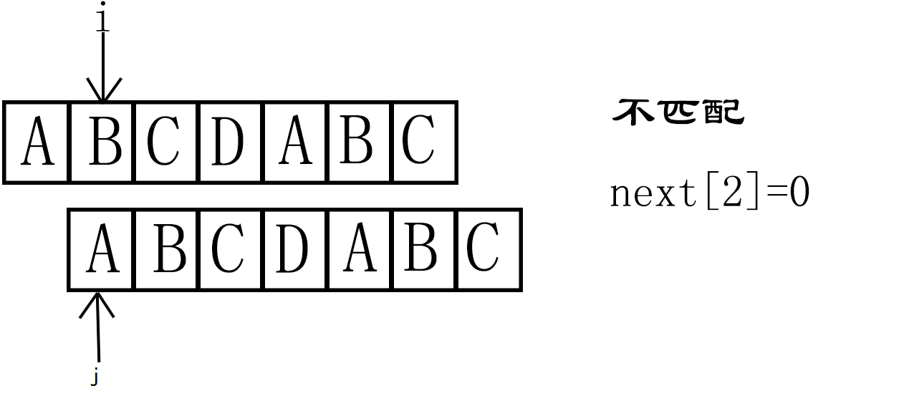
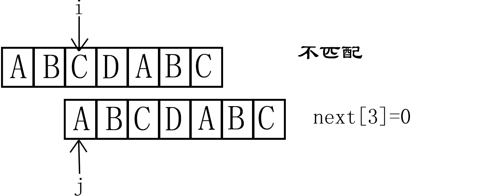
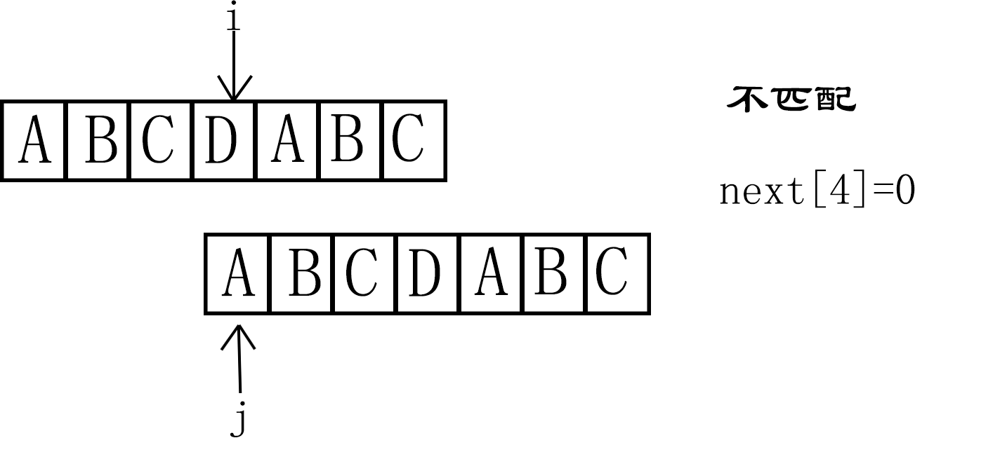
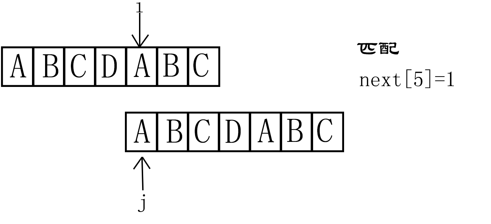
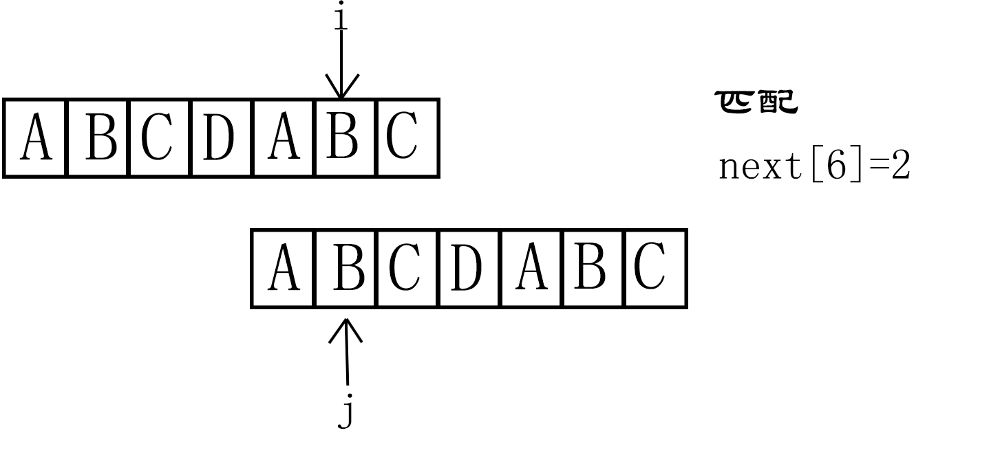

# 字符串匹配算法
&nbsp;&nbsp;&nbsp;&nbsp;&nbsp;&nbsp;&nbsp;&nbsp;&nbsp;我们用的最多的就是编程语言提供的字符串查找函数，如Java中的indexOf（），Python中的find()函数等，底层都是依赖字符串匹配算法。

&nbsp;&nbsp; &nbsp; &nbsp;先定义两概念：**主串**、**模式串** ，主串长度记作n，模式串长度记作m。

1.  ## BF 算法  ——(暴力)朴素匹配算法

BF 思想简单概括:  在主串中，**检查起始位置**分别为0、1、2... n-m   且长度为m的n-m+1 个子串 ， 看有没有跟**模式串匹配**的 
  

3.  ## BM算法
&nbsp;&nbsp;我们把模式串和主串的匹配过程，看作模式串在主串中不停地往后滑动。当遇到不匹配的字符时，BF和RK算法的做法是，模式串往后滑动一位，然和从模式串的第一个字符开始重新匹配。
  BM算法两个重要规则及匹配顺序：

   * **匹配顺序是从模式串末尾开始匹配** 

   * **坏字符规则  (没有匹配的字符就叫作坏字符)**
              
   模式串 **后移的位数**  = **模式串个数** - **每个坏字符串在模式串出现个数** - 末尾匹配成功个数(直到 **匹配到第一个坏字符** )
            

  例如：

 
            

   * **好后缀规则** 
     &nbsp;&nbsp; &nbsp;&nbsp;将好后缀记作{A}，将模式串中与{A}匹配的记作{*A}，

   步骤： 
   &nbsp;&nbsp;&nbsp;&nbsp;第一步：在 **主串** 中找到 **好后缀** ; 
  &nbsp;&nbsp;&nbsp;&nbsp;第二步：拿 **好后缀{A}** 在 **模式串中查找** ; 
   &nbsp;&nbsp;&nbsp;&nbsp;第三步：如果找到了另一个跟**好后缀{A}相匹配的子串**,那我们将**模式串滑动到{*A}与主串中的{A}对齐的位置**。  
  &nbsp;&nbsp;&nbsp;&nbsp;第四步：如果在模式串中找不到另一个等于{A}的子串，且 **模式串前缀子串** 没有与 **好后缀子串重合** 的部分，就直接将模式串，滑动到好后缀{A}的后面。  
  &nbsp;&nbsp;&nbsp;&nbsp; 第五步：若模式串的前缀子串与好后缀的后缀字符串重合，我们从**好后缀的后缀字符串** 中，找 **最长** 的并且能跟 **模式串的前缀字符串匹配的** ，将模式串滑动到该位置。 
   &nbsp;&nbsp;&nbsp;&nbsp; 字符串的后缀字符串：就是子串是跟 **最后一个字符** 对齐的字符串。例如：
   

    
 &nbsp;&nbsp; &nbsp;&nbsp;字符串的前缀字符串：就是子串是跟 **第一个字符** 对齐的字符串。例如：
    

            
 如何选择用好后缀规则还是坏字符规则？ 
 我们可以分别计算好后缀和坏字符往后滑动的位数，然后取两个数最大的，作为模式串往后滑动的位数。

4. ## KMP 算法

&nbsp;&nbsp;  将已经匹配的那段字符串叫作好前缀。

* 最长可匹配后缀子串：在好前缀的的所有后缀子串中，最长的可与前缀子串匹配的子串。
* 最长可匹配前缀子串：在好前缀的的所有前缀子串中，最长的可与后缀子串匹配的子串。

* KMP算法也可以提前构建一个数组，用来存储模式串中每个前缀的 **最长可匹配前缀子串的 ++个数++** ，将其定义为next数组（也就是书中所讲的 **失效函数** ）。   其中++数组的下标是每个 **好前缀候选** 字符个数++，++值是 **最长可匹配前缀子串的个数** ++。请结合下表理解。

例子：  模式串 a b a b a c d

| 模式串前缀（好前缀候选）    | 好前缀候选字符个数     |  最长可匹配前缀子串的个数| next值|
| --------- | -------- | -----: | --: |

|    NULL       | 0      |  -1      |   next[0]=-1   |
|a     | 1 |  0   | next[1]=0   |
|a b|2|0 |  next[2]=0  |
|a b a|3|  1     |   next[3]=1 |
|a b a b|    4     | 2      |  next[4]=2   |
|a b a b a|     5    |     3  |  next[5]=3  |
|a b a b a c|6         |  0   |    next[6]=0|

KMP算法只需要一个额外的next数组(也就是书中说的失效函数)，数组大小等于模式串长度

* 另一种快速求失效函数的方法：

从模式串的第一位(注意，不包括第0位)开始对自身进行匹配运算。 

如果匹配不成功，要重新对自身进行匹配;若匹配成功，则不用重新对自身进行匹配。(模式串最长前缀字符结束)

失效函数的值是最长可匹配前缀子串的个数

例如： 模式串A B C D A B C

请看下面的图理解：

<h2 align="center" > (1)</h2>

<h2 align="center" > (2)</h2>

<h2 align="center" > (3)</h2>

<h2 align="center" > (4)</h2>

<h2 align="center" > (5)</h2>
